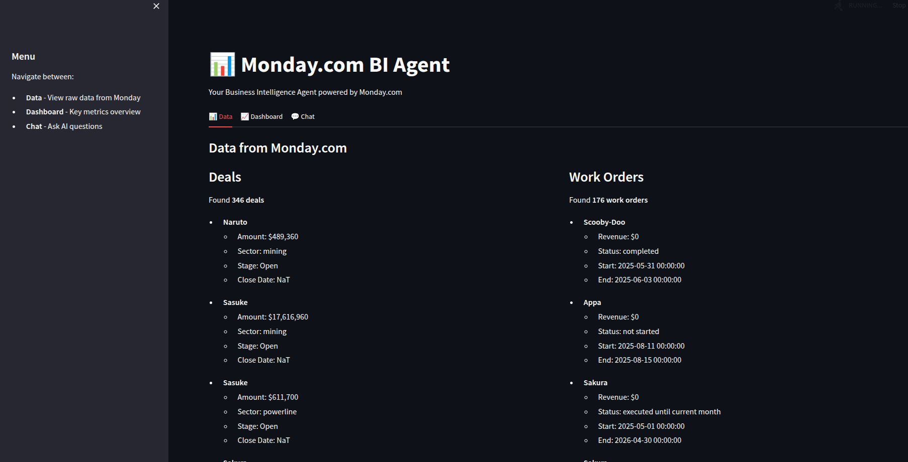
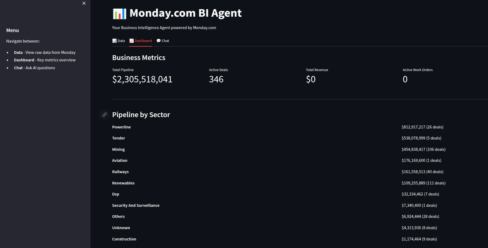

# Business Intelligence — Streamlit + monday.com

Minimal Streamlit app that fetches data from monday.com, cleans it, computes simple BI metrics, and answers founder-level questions via an LLM/agent.

## Quick start

- Install dependencies: `pip install -r requirements.txt`
- Run the app: `streamlit run app.py`

## Project layout

- `app/` — application modules (monday client, cleaner, metrics, llm, agent)
- `images/` — place image files referenced below

## Images

Add three images into the `images/` folder. The README references these placeholder names — replace with your files as needed:

- images/image1.png
- images/image2.png
- images/image3.png
- images/image4.png
- images/image5.png
- images/image6.png

You can reference them in README or the UI like:






## Notes

- Config values are intentionally simple and hardcoded for ease of local development (see `app/config.py`).
- The agent can operate without LangChain installed; installing `langchain` enables the optional agent pattern.

## Configuration & secrets

Do NOT commit `app/config.py` with API keys or secrets. Configuration should come from environment variables or a local `app/config.py` copied from `app/config.example.py`.

Required environment variables:

- `GEMINI_API_KEY`
- `GEMINI_MODEL` (optional; default shown in `app/config.example.py`)
- `MONDAY_API_KEY`
- `DEALS_BOARD_ID`
- `WORK_ORDERS_BOARD_ID`

Local development example (bash):

```bash
export GEMINI_API_KEY="..."
export MONDAY_API_KEY="..."
export DEALS_BOARD_ID="5026563889"
export WORK_ORDERS_BOARD_ID="5026563899"
streamlit run app.py
```

There is an `app/config.example.py` file you can copy and edit for local use. `.gitignore` now excludes `app/config.py` and `.env`.
# Monday.com BI Agent - Minimal Backend

A simple FastAPI application that connects to monday.com, fetches deals and work order data, cleans it, and answers founder-level business questions using LLM-powered insights.

## 🎯 Quick Start

### 1. Setup Environment

```bash
cd /home/oxytocin/Documents/code/Bussiness_intelligence
cp .env.example .env
```

Edit `.env` with your credentials:
```
MONDAY_API_KEY=your_key
DEALS_BOARD_ID=your_id
WORK_ORDERS_BOARD_ID=your_id
OPENAI_API_KEY=your_key
```

### 2. Install Dependencies

```bash
pip install -r requirements.txt
```

### 3. Run Server

```bash
python app/main.py
```

Server starts at `http://localhost:8000`

### 4. Test Endpoint

```bash
curl -X POST http://localhost:8000/chat \
  -H "Content-Type: application/json" \
  -d '{"message": "What is our total pipeline?"}'
```

## 📁 Project Structure

```
app/
  main.py         - FastAPI app, endpoints
  config.py       - Environment variables
  monday.py       - GraphQL API integration
  cleaner.py      - Data cleaning logic
  metrics.py      - KPI calculations
  llm.py          - OpenAI integration
```

## 🔹 Supported Questions

**Deals:**
- "What's our total pipeline?"
- "Energy sector pipeline this quarter?"
- "How many deals do we have?"

**Work Orders:**
- "Total revenue delivered?"
- "How many active work orders?"

**Leadership:**
- "Give me a summary"
- "Board update"

## 🛠️ Key Features

✅ Simple GraphQL integration with monday.com  
✅ Robust data cleaning (handles nulls, missing values)  
✅ Core metrics: pipeline, revenue, counts  
✅ LLM intent parsing & response generation  
✅ Error handling & data quality notes  
✅ Clean modular architecture  

## 🚀 What's Next

1. Add exact Monday GraphQL queries
2. Build LLM prompts for intent parsing
3. Add deployment guide

---

Built for a 6-hour assignment. Simple, clean, correct.
